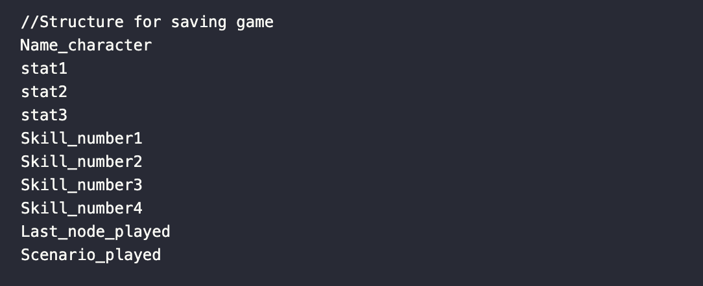
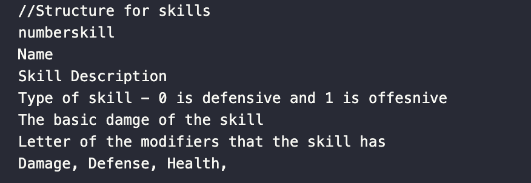
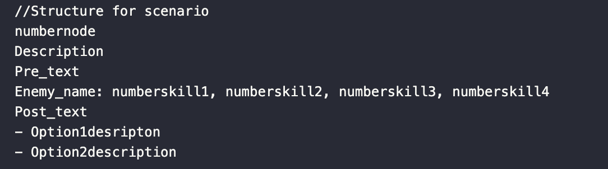

# DATA STRUCTURES AND ALGORITHMS II, 2023-2024
## PROSOMOIOSI
PRACTICE: 102

GROUP: 14

MEMBERS: Noel(U232376), Arlet(U230940), Sushant(U233578)

DATE OF SUBMISSION: 29/05/2024
## TABLE OF CONTENTS
1. INTRODUCTION

2. PROJECT OBJECTIVE

    2.1 MANDATORY OBJECTIVES MET

    2.2 DESIRABLE OBJECTIVES MET

    2.3 EXPLORATORY OBJECTIVES MET

3. SOLUTION

    3.1 SYSTEM ARHITECTURE

    3.2 ERROR HANDLING

    3.3 DATA MODEL DESIGN

    3.4 DATASET DESCRIPTION AND PROCESSING

4. ETHICAL CONSIDERATIONS

5. REFERENCES

### 1. INTRODUCTION 

Our game name is PROSOMOIOSI which is the word for simulation in Greek. We chose this name because our game is situated that you are inside a simulation in which your objective is to discover that you are in a simulation and try to get outside of this simulation. 

Now that you know what is the context of our game let’s dig into the problems we had during the process of completing this game. The first dilemma that we had was to choose to use the file JSON or not, in our case, we decided to not to use it because we hadn’t used it before. Another important problem we had was how to structure the information we wanted to be taken from the text file, this problem was solved by trying many different formats until our functions worked. 


### 2. PROJECT OBJECTIVE

#### 2.1 MANDATORY OBJECTIVES MET 
1. Creation of the main character with the basic attributes mentioned above (Name, abilities, HP, ATT, DEF, and any other attribute defined by the programmers) and the rest of the structs.

    In our game, the character can have 4 skills, and every skill provides damage, defense, and health. So the stats he has will depend on the skills he chooses. These are the main data structures of your game: all of them are located in common.h.
    ```C
        typedef struct { //Our data structure for the skills
            char name[MAX_NAME];
            char description[MAX_TXT];
            int of_def; //1 for offensive, 0 for defensive
            int dmg_skll;// 5-40
            Mod mod;
            int stats_plyr[3]; //dmg(0), def(1), hp(2)
            /*int dmg_plyr; 0 - 3       int def_plyr; 0 - 8       int hp_plyr; 20 - 50 */
            int skill_number;
        } Skill;

        typedef struct{ //This is our data structure for the character
            char name[MAX_NAME];
            int stats[3];//dmg(0), def(1), hp(2)
            //int dmg; 12 - 32      int def; 0 - 32       int hp; 100 - 200
            Skill skill[4];
        }Character;

        typedef struct{ //This is our data structure for the Enemy
            char name[MAX_NAME];
            int stats[3];//dmg(0), def(1), hp(2)
            Skill skill[4];
        }Enemy;

        typedef struct{
            char description[MAX_TXT];
            char pre_txt[MAX_TXT];
            Enemy enemy;
            char post_txt[MAX_TXT];
            char option1[MAX_TXT];
            char option2[MAX_TXT];
        }Option;

        typedef struct{
            Option option;
            struct Decision *next;
            int node_number;//This will help us to save the game 
        }Decision;

        typedef struct{
            Decision *start;
            Decision *end;
            int decisions_added;
            char filename[MAX_NAME];
            int edges[MAX_NODE][2];
        }Scenario;
    ```

    To create a character we use a function called create_caracter which helps us to create one: 
    Basically what is done here is that the player chooses his name and then we ask the player in which stats he wants the skills to be printed prioritizing damage, defense, or health and then we let him select the skills. The function chose skill is used so that the user can try some skill see the stats it has and select the one he likes. The big O for the function chosen skill is O(n) where n is the number of skills he can choose from. 

    The big O for the function create character is also O(n) because all the functions it uses are printed with for loops which do not affect the the big O. At the beginning these functions were simple but as we progressed we added elements to them. The function create_caracter is located in rpggame.c at line 143 and the function chose_skill is in the same file but in line 113. In terms of improving it, we could have added more skills to choose for the user. If we had more time we would have liked to add many more functions that could help him more personalize the character. 

2. Each scenario must present a text telling a piece of the story and a decision. Depending on the player's decision, a narrative text and between zero and two battles with enemies should be presented.

    ```C
        Scenario *create_inizialize_Scenario();
        //Function to add a Decision to the Scenario
        void addDecisionToScenario(Scenario *scenario, Decision *decision);
        void go_to_node_select_and_add(int node,char *filename,Scenario *scene, Character* plyr);
        void get_skill(Skill *skill, int n);
        void put_enemy_info(char *line, Enemy *boss);
        void print_decision(Decision *choice, Character* plyr, Scenario* scene);
    ```

    In the code, the scenario is a link list of decisions. And each scenario has its beginning and end. Each decision has an option data structure variable. The scenario also has the number of decisions added and then a filename which saves the name of the file of the scenario. So when we play what we do is we create and initialize a scenario with the function create_inizilialize_scenario and then we add the nodes which will be decisions with the help of other functions. 
    
    The main function that helps us to implement this is go_to_node_select_and_add, this function basically goes to the decision that we want, it takes the information, adds it to the link list, saves the information added to auto-save, and then prints the information. Then we have another function called run_game that basically helps us to play the scenario from any point using the functions that we talked about. There is also a function that reads the information from the text file and puts the information these functions are get_skill which gets the information about skills, get_info_descion which gets the decision information, we also have put_enemy_info which helps us to put the enemy information. 
    
    In our game, we have 1 vs 1 combat but there are at least 2 enemies that you have to fight per scenario. Talking about big O, there are functions many functions that are used to read from files all of these functions have O(n) complexity n will be the number of the lines that the files have. The functions that create and allocate memory have complexity of O(1) because these function performs a constant number of operations regardless of the size of the scenario. There are many improvements that we would like to add if there was more time for example if the user wanted to go back to the previous node and make another decision. We would have also liked to have some images that represent each scenario, we would have also liked to add the graphical part for the combat. We weren't certain how to implement all these functions so this part was one of the parts that took most of the time. The majority of the functions mentioned above are in rpggame.c except print decision which is in print.c at line 57. The function get_skill is in line 51, put_enemy_info is in line 170 and all other functions are below it. 

3. 

#### 2.2 DESIRABLE OBJECTIVES MET
1. Implementation of a data reading (loading) system from an external file for the initial configuration of the Character, the Scenarios, the skills, and the Enemies. The base file should be a plain text or a JSON formatted file.

    In our case we haven’t used JSON we have used text files. All the information is structured in a certain order that helps the algorithm to get the information. You can see the structures for the text of the skills and the decisions in the format.txt file. The main functions that helps us to get the information are get_skill which helps to get the information about the skill, the function put_enemy_info which helps us to the enemy information, and get_info_decision which helps us to get the information about a certain decision. 

    ```C
    void get_skill(Skill *skill, int n);
    void put_enemy_info(char *line, Enemy *boss);
    void get_info_decision(Decision *choice, int node_number, char *filename_txt);
    ```

    The function get skill receives as a parameter a skill where to save the information about the skill and the number of skill. Every skill has a number so by the number it will be easy to look for the information. 
    The function put_enemy receives as a parameter a string that has the enemy's information and an enemy where to save the information. The function get_info_decision receives as parameters a decision where to save the information, the node number of the decision, and the filename where he has to look the information from. Let’s talk about the Big O of the get_skill it has a complexity of O(n) where n is the number of the lines he has to read from the file. The put_enenmy_info also has complexity O(n) where n will be the length of the string. And at last, we have get_info_decision which also has the complexity of O(n) where n is the number of the lines he has read from the file. Well, these functions were not easy to program the difficulty here was how to structure the information, we tried many different formats and algorithms until we found the correct one. Here we would have liked to add more options for the user to choose rather than having just two. All the functions mentioned above are in rpggame.c. Get_skill is in line 51, put_enemy_info is in line 170 and get_info_decision is in line 201.

2. Functional implementation of one of the search and/or sorting algorithms seen in theory classes. 
    In our case, we have used the sorting algorithm just for one case which is when we asked the user to choose skill. We ask the user in which order he wants the skills to be shown prioritizing damage, defense, or attack. If you look at our skill data structure there is an array of called stat players, where the first index is damage, the second index is defense and the third index is health. When we sort the skills we take into account these variables. To sort our skills we used QuickSort, this function was provided to us in one of the seminars that we did. What we do first is sort out the array of skills taking into account what the user has asked for and then print them. The main functions that we use here are all the functions related to Quicksort and the function order skill which helps us to order the skill. 

    ```C
    //order skills
    void swap(Skill* p1, Skill* p2);
    int partition(Skill arr[], int low, int high, int n);
    void quickSort(Skill arr[], int low, int high, int n);
    void order_skills(int n, Skill* skills);
    ```

    We use the function swap to swap the skills in the array. We use the partition function which helps us to make sure that all the elements on the left are smaller than the pivot and all the elements on the right are greater than the pivot, the n we receive as parameters here helps us to indicate in which stats he would like the skills to be ordered. And at last, the function order_skills uses the quicksort. This function receives a skill array and the n which is the number that indicates to us in which order he wants to arrange it. The Big O of the quicksort is O(n log n) and the worst case is O(n^2). These functions were already provided so we just had to adapt them to our data structures. 

#### 2.3 EXPLORATORY OBJECTIVES MET
1. Implementation of a system for saving and loading the game state based on files. 

    

    Well to save the game we have used a specific format that helps us to save the game and then to load the game we get the information from a saved file and then we put it into the corresponding variables. The main functions used for this objective is save_game and load_game_and_play. 
    
    ```C
    void save_game(Scenario *scene, Character *character, char* buffer);
    int load_game_and_play(char* buffer, Character* plyr, int* last_node_number);
    ```

    The save_game receives a scenario a character and a filename that the user wants to save. Then inside the save_game, we have a function called get_last_node_number which traves the scenario link list and gets the last node number.  After having these information we open a file pointer and  save it inside the file following the structure above.
    The function load_game_and_play receives as parameters the file name where the information is saved, a character variable to save the information taken out of the file, and a pointer integer which will save the last_node_number played which will help us to play the game after by calling the function run game. Notice that if you have the skill timestrike when saving the file none of the information about it will be saved except the skill number and when we load a game the timestrike stack will be empty. The save_game function has complexity O(1) because it because it performs a constant number of operations and the big O for the load_game is O(n) where n is the number of the lines he has to read from the file. These functions required time to program because we didn’t know in which way would be more effective to save it, we tried many different formats until we reached the actual one. These functions are located in rpggame.c. Save_game is in line 354 and load_game_and_play is in line 428. 


### 3. SOLUTION
.....

#### 3.1 SYSTEM ARHITECTURE
.....

#### 3.2 ERROR HANDLING
.....

#### 3.3 DATA MODEL DESIGN
....

#### 3.4 DATASET DESCRIPTION AND PROCESSING 
Each scenario has a text file for itself. The information about skills is also saved in a text file, in this text file we have saved both the information about the skills of the characters and the enemies. And for saving the game at a certain point we also use a certain structure. All this information is in the file name format.txt. 



We have the number of skills, then we have the description of the skill, we have of what type it is, then we have the basic damage of the skill, we have the first letter of the modifier that it has, and then, at last, we save the damage, defense, and health the skill provide. 



For the scenario, we follow the format provided in the image above. First, we have the node number, then the description of the decision, then we have the pre-text and then we have the enemy information with its name and the skill numbers that he has. After this, we have the post-text and the 2 descriptions for the next options the user can choose. 


To save the game, we follow we save the character name, the stat they had damage defense and health, the number of skills that they were using, the last node number that they played, and at last we save the last_scenario that he played. 

### 4. ETHICAL CONSIDERATIONS
We have searched for information about different things on the internet we will put the link below to the consulted sites.  All the material from the theory classes was very useful. We have also made use of AI, especially Chat Gpt. The functions provided by Chat Gpt have been commented on as provided by Chat Gpt in the project code.  Most of the logical part was done by us but we asked them to improve our reasoning or to know what problems our algorithms could have. We also asked Chat Gpt for boundary cases for some functions.

### 5. REFERENCES
We principally looked at information provided in the theory class.  All the information about stack and queue, the sorting algorithm was useful and the theory we have seen about the graphs was also very useful. We would like to thank also our professor for the Lab sessions because he helped us clear our doubts regarding many things that we questioned during the process of making the games. Below there we will be some links to the websites we consulted information from: 

    - https://www.geeksforgeeks.org/linked-list-data-structure/ 
    - https://www.geeksforgeeks.org/stack-data-structure/ 
    - https://www.geeksforgeeks.org/sorting-algorithms/ 
    - https://www.geeksforgeeks.org/header-files-in-c-cpp-and-its-uses/ 


  
    
